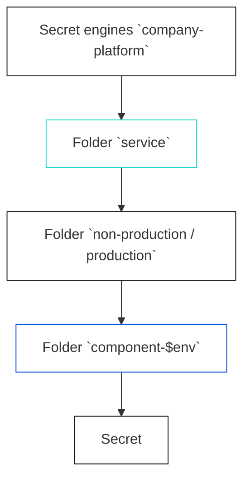

# Config Application

การ Config Application ที่ต้องการใช้งาน secret management (vault) โดยสามารถจัดเก็บข้อมูล sensitive information เช่น credentials, Passwords เพื่อนำมาใช้กับ application ที่ทำการ deploy ที่ opstella

## หลักการทำงาน opstella and vault


<ins>อธิบายเพิ่มเติม</ins>
การจัดเก็บข้อมูลของ vault จะมีการจัดเก็บเป็น folder เพื่อแบ่งสิทธิ์การใช้งาน <br/>



การจัดเก็บข้อมูล Secret ใน vault จะแยก env เป็น folder เพื่อง่ายต่อการจัดเก็บและแยกส่วนได้อย่างชัดเจน <br/>
เมื่อทำการเก็บข้อมูล Secret เรียบร้อย ระบบ opstella จะทำการ Sync Secret ไปที่ Kubernetes ให้อัตโนมัติ <br/>
**โดยจะนำไปจัดเก็บที่เมนู Secret และอยู่ใน namespace ตาม environment ที่จัดเก็บตาม folder**

<ins>ตัวอย่าง</ins> <br/>
Company: consultant <br/>
Platform: hybridcloud <br/>
Service: wallet <br/>
Component: api <br/>

**กรณีต้องการเก็บข้อมูล Secret ที่ environment dev เพื่อนำไปใช้กับ component api** <br/>
ให้ผู้ใช้งานนำข้อมูล secret ไปใส่ไว้ที่ folder api-dev จากนั้นระบบ opstella จะทำการ sync ข้อมูล secret มาให้ <br/>
โดยจะอยู่ที่ Secret (ชื่อ secret คือ **`api`**) ใน namespace **`consultant-hybridcloud-wallet-dev`**

**การใช้งาน Vault UI (สามารถเข้าสู่การใช้งาน vault ได้ 2 ทาง)**

## การเข้าใช้งาน Vault UI ด้วยเมนู SSO {#vault-with-sso-page}

1.คลิกที่เมนู "SSO" ดังรูป


2.เลือก Platform ที่ต้องการด้านบนขวา ดังรูป


3.คลิกเลือกที่ปุ่ม vault (secret management) ดังรูป


4.ระบบจะแสดงหน้าต่างเพื่อเข้าใช้งาน vault **ในกรณีที่อยากเข้าสู่เมนู secret engine** ให้คลิกที่ปุ่มดังรูป


5.ระบบจะแสดงหน้าต่างเพื่อเข้าใช้งาน vault **ในกรณีที่อยากเข้าสู่เมนู secret** ให้ทำการเลือก service และ component ที่ต้องการ **(1)** และเลือกคลิกปุ่มตาม environment ที่ต้องการเข้าถึง **(3)** ดังรูป


6.ระบบจะแสดงหน้าต่างขึ้นใหม่เพื่อเข้าสู่ vault ดังรูป


## การเข้าใช้งาน Vault UI ด้วยหน้า Component Detail {#vault-with-component-detail-page}

1.คลิกที่เมนู “App Inventory” ดังรูป


2.เลือก Platform ของ Component ที่ต้องการจะเข้าสู่หน้า Component Detail ดังรูป


3.เลือก Service ของ Component ที่ต้องการจะเข้าสู่หน้า Component Detail ดังรูป


4.เลือก Component ที่ต้องการจะเข้าสู่หน้า Component Detail และคลิกปุ่ม option **(1)** และเลือกเมนู Detail **(2)** ดังรูป


5.ระบบจะแสดงหน้า Component Detail ดังรูป


6.ไปที่ส่วน SSO of Component ด้านล่าง และคลิกเลือกปุ่ม vault (secret management) ดังรูป


7.ระบบจะแสดงหน้าต่างเพื่อเข้าใช้งาน vault

- **ในกรณีที่อยากเข้าสู่เมนู secret engine** ให้คลิกที่ปุ่ม engine **(1)**
- **ในกรณีที่อยากเข้าสู่เมนู secret** เลือกปุ่ม environment ที่ต้องการเข้าถึง **(2)** ดังรูป
  

  8.ระบบจะแสดงหน้าต่างขึ้นใหม่เพื่อเข้าสู่ vault ดังรูป
  

## Config Application with secret (File)

1.เข้าสู่ระบบ Vault โดยเข้าสู่เมนู secret ดังหัวข้อด้านบน [การเข้าใช้งาน Vault UI ด้วยเมนู SSO](#vault-with-sso-page) หรือ [การเข้าใช้งาน Vault UI ด้วยหน้า Component Detail](#vault-with-component-detail-page)

2.เมื่อเข้าสู่หน้า Secret ระบบ Vault จะแสดงผลดังรูป


3.เมื่อต้องการเพิ่มข้อมูล secret ใหม่ให้คลิกที่ปุ่ม "Create new version" ด้านขวาบน ดังรูป


4.เพิ่มข้อมูล secret หรือ credential ที่ต้องการ ในกรณีเป็นไฟล์ **key คือ ชื่อไฟล์** และ **value คือ ข้อมูล secret หรือ credential ภายในไฟล์**


5.เมื่อใส่ข้อมูลครบแล้วให้กดที่ปุ่ม save เพื่อบันทึกข้อมูล ดังรูป


6.เมื่อบันทึกข้อมูลเสร็จสิ้นระบบ Vault จะแสดงข้อมูลที่ได้บันทึกดังรูป


7.จากนั้นให้เข้าสู่ระบบ opstella และเลือกที่เมนู App Inventory ดังรูป


8.เลือก Platform ของ Component ที่ต้องการจะเข้าสู่หน้า Component Detail ดังรูป


9.เลือก Service ของ Component ที่ต้องการจะเข้าสู่หน้า Component Detail ดังรูป


10.เลือก Component ที่ต้องการจะเข้าสู่หน้า Component Detail และคลิกปุ่ม option **(1)** และเลือกเมนู Detail **(2)** ดังรูป


11.ระบบจะแสดงหน้า Component Detail ดังรูป


12.ไปที่ส่วน Helm Value ด้านล่าง จากนั้นเลือก environment helm file ที่ต้องการแก้ไข ดังรูป


13.ระบบจะแสดงหน้าต่างเพื่อแก้ไขไฟล์ helm value ดังรูป


14.ใส่ข้อมูล secret ลงไปในส่วน existingFileSecrets **(1)** จากนั้นกดปุ่ม save **(2)** ดังรูป

```json
  - name: api
    path: /app/appsettings.develop.json
    subPath: appsettings.develop.json
```

**รายละเอียด**

- **name** คือชื่อ secret (component name)
- **path** คือ path ของไฟล์ที่จะนำไปใช้งานใน pod
- **subPath** คือ ชื่อไฟล์ที่ต้องการใช้ secret


15.ระบบจะทำการ Re Deploy อัตโนมัติด้วยโฟลของ ArgoCD สามารถดูการใช้งาน CD ได้ที่นี่ [ArgoCD UI](./argocd-ui.md)

## Config Application with secret (env, field)

1.เข้าสู่ระบบ Vault โดยเข้าสู่เมนู secret ดังหัวข้อด้านบน [การเข้าใช้งาน Vault UI ด้วยเมนู SSO](#vault-with-sso-page) หรือ [การเข้าใช้งาน Vault UI ด้วยหน้า Component Detail](#vault-with-component-detail-page)

2.เมื่อเข้าสู่หน้า Secret ระบบ Vault จะแสดงผลดังรูป


3.เมื่อต้องการเพิ่มข้อมูล secret ใหม่ให้คลิกที่ปุ่ม "Create new version" ด้านขวาบน ดังรูป


4.เพิ่มข้อมูล secret หรือ credential ที่ต้องการ ในกรณีเป็นฟิลด์ **key คือ ชื่อฟิลด์** และ **value คือ ข้อมูล secret หรือ credential**


5.เมื่อใส่ข้อมูลครบแล้วให้กดที่ปุ่ม save เพื่อบันทึกข้อมูล ดังรูป


6.เมื่อบันทึกข้อมูลเสร็จสิ้นระบบ Vault จะแสดงข้อมูลที่ได้บันทึกดังรูป


7.จากนั้นให้เข้าสู่ระบบ opstella และเลือกที่เมนู App Inventory ดังรูป


8.เลือก Platform ของ Component ที่ต้องการจะเข้าสู่หน้า Component Detail ดังรูป


9.เลือก Service ของ Component ที่ต้องการจะเข้าสู่หน้า Component Detail ดังรูป


10.เลือก Component ที่ต้องการจะเข้าสู่หน้า Component Detail และคลิกปุ่ม option **(1)** และเลือกเมนู Detail **(2)** ดังรูป


11.ระบบจะแสดงหน้า Component Detail ดังรูป


12.ไปที่ส่วน Helm Value ด้านล่าง จากนั้นเลือก environment helm file ที่ต้องการแก้ไข ดังรูป


13.ระบบจะแสดงหน้าต่างเพื่อแก้ไขไฟล์ helm value ดังรูป


14.ใส่ข้อมูล secret ลงไปในส่วน secretName **(1)** จากนั้นกดปุ่ม save **(2)** ดังรูป

```json
  secretName: api
```

**รายละเอียด**

- **secretName** คือชื่อ secret (component name)
  **ส่วนนี้จะเป็นค่า default by opstella**


15.ระบบจะทำการ Re Deploy อัตโนมัติด้วยโฟลของ ArgoCD สามารถดูการใช้งาน CD ได้ที่นี่ [ArgoCD UI](./argocd-ui.md)
